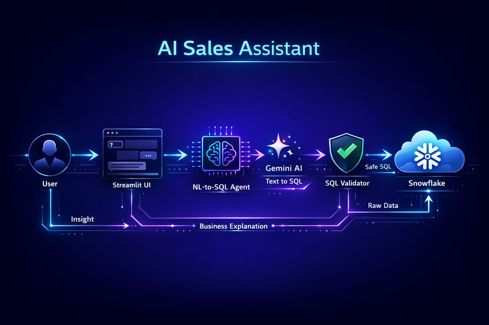
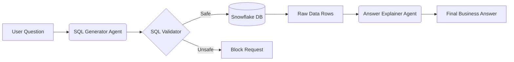

# Enterprise Sales Assistant AI: NL-to-SQL Agent 🚀

**An AI-powered analytics assistant that turns natural language questions into safe, executable SQL queries on Snowflake.**

Built with **Python**, **Streamlit**, **Google Gemini 2.5 Flash**, and **Snowflake**.

  

---

# 📄 Project Report: Implementation & Insights

## 1. Project Objective
The primary goal of the **Sales Assistant AI** was to bridge the gap between non-technical sales teams and complex CRM data stored in **Snowflake**. 

Traditional workflows require sales managers to rely on data analysts for every report (e.g., *"How many leads did we close this week?"*). This project allows users to ask questions in plain English and receive instant, data-backed answers, effectively democratizing data access within the organization.

**Key Goals Achieved:**
*   Eliminated the need for writing SQL queries manually.
*   Implemented a safe, "read-only" architecture to prevent data mishaps.
*   Provided business context alongside raw numbers using Generative AI.

---

## 2. Implementation & Architecture (Structured RAG)

The system was built using a **Structured Agentic Architecture** rather than traditional RAG (Retrieval-Augmented Generation). Instead of embedding documents, the AI generates executable code (SQL) based on a strict schema definition.



### **Core Components:**

1.  **Orchestrator Agent (`nl_sql_agent.py`)**:
    *   The central brain that manages the lifecycle of a user request.
    *   It coordinates the hand-off between the SQL Generator, Validator, Executor, and Explainer.
    *   **User Question**: Input via Streamlit Chat UI.

2.  **SQL Generator (`sql_generator.py`)**:
    *   Utilizes **Google Gemini 2.5 Flash** to translate natural language into Snowflake SQL.
    *   It helps the LLM understand the database structure via a dedicated `schema_context.py` file, which defines tables like `CUSTOMERS`, `LEADS`, and `OPPORTUNITIES`.

3.  **Safety Layer (`sql_validator.py`)**:
    *   A critical security module that scans generated SQL.
    *   **Rule:** It strictly forbids destructive commands (e.g., `DROP`, `DELETE`, `UPDATE`) and ensures all queries are `SELECT` statements.

4.  **Execution Layer (`query_executor.py`)**:
    *   Manages the connection to the Snowflake Data Cloud.
    *   Executes the validated query and retrieves raw rows/columns.

5.  **Answer Explainer (`answer_explainer.py`)**:
    *   Takes the raw data returned from Snowflake and passes it back to Gemini.
    *   Generates a professional, business-friendly summary of the findings (e.g., *"Stalled deals account for $450k in potential revenue..."*).

6.  **User Interface (`app.py`)**:
    *   Built with **Streamlit** for rapid deployment.
    *   Customized with CSS to feature a modern, transparent "ChatGPT-style" chat interface with a persistent background.

---

## 3. Technology Stack

| Component | Technology | Role |
| :--- | :--- | :--- |
| **Language** | Python 3.10+ | Core logic and backend scripting. |
| **Frontend** | Streamlit | Chat interface and state management. |
| **LLM** | Google Gemini 2.5 Flash | Natural Language Understanding & SQL Generation. |
| **Database** | Snowflake | Cloud Data Warehouse housing CRM data. |
| **Driver** | snowflake-connector-python | Low-level connectivity to Snowflake. |
| **Libraries** | python-dotenv, google-generativeai | Environment security and API wrappers. |

---

## 4. Key Learnings (Development Journey)

1.  **The "Context Window" is Critical**: Simply asking an LLM to "write SQL" fails without context. I learned to provide a strict **Schema Definition** (table names, column types) in the prompt to ensure 100% accuracy.
2.  **LLMs Cannot Be Trusted Blindly**: I discovered that LLMs might hallucinate tables that don't exist. Implementing the **SQL Validator** was a crucial step to ensure the system never attempts to run invalid or dangerous code.
3.  **Separation of Concerns**: Splitting the logic into explicit layers (Generator vs. Validator vs. Executor) made debugging significantly easier than having one giant function.
4.  **UI/UX with Streamlit**: I learned how to inject custom CSS into Streamlit to break out of its default "boxy" look, creating a premium transparent glassmorphism effect.

---

## 5. Hands-on Skills Demonstrated

*   **Agentic AI Workflow Design**: Orchestrating multiple AI steps (Generate -> Validate -> Explain) to solve a complex task.
*   **Prompt Engineering**: Designing system prompts that constrain the LLM to specific behaviors (e.g., "Return ONLY SQL").
*   **Database Integration**: Securely connecting a Python application to a production-grade cloud data warehouse (Snowflake).
*   **Full-Stack Python**: Building both the backend logic and the frontend UI within a single language ecosystem.
*   **Security Best Practices**: Managing API keys and Database credentials using environment variables (`.env`) instead of hardcoding them.

---

## 🚀 Setup & Installation (Reproduce this Project)

### 1. Clone the Repository
```bash
git clone https://github.com/your-username/sales-assistant-ai.git
cd sales-assistant-ai
```

### 2. Set Up Virtual Environment
```bash
# Windows
cd backend
python -m venv venv
venv\Scripts\activate

# Mac/Linux
cd backend
python3 -m venv venv
source venv/bin/activate
```

### 3. Install Dependencies
```bash
pip install -r requirements.txt
pip install streamlit google-generativeai python-dotenv snowflake-connector-python
```

### 4. Configure Environment Variables
Create a `.env` file in the project root (`sales-assistant-ai/.env`):

```ini
# Snowflake Credentials
SNOWFLAKE_USER=your_user
SNOWFLAKE_PASSWORD=your_password
SNOWFLAKE_ACCOUNT=your_account_identifier  # e.g., xy12345.us-east-1
SNOWFLAKE_WAREHOUSE=COMPUTE_WH
SNOWFLAKE_DATABASE=SALES_AI
SNOWFLAKE_SCHEMA=CRM

# Google Gemini API Key
GEMINI_API_KEY=your_gemini_api_key
```

### 5. Run the Application
From the `backend` directory:
```bash
streamlit run ui/app.py
```

---

## 💡 Example Questions to Ask

*   *"Who are my top 5 customers by total opportunity value?"*
*   *"Show me all stalled deals worth more than $50,000."*
*   *"What is the average lead score for 'qualified' leads?"*
*   *"Count the number of opportunities in each stage."*
*   *"List recent sales activities for customer 'TechCorp'."*

---

## 📂 Project Structure

```
sales-assistant-ai/
├── .env                  # Secrets (Not committed)
├── README.md             # This Documentation
├── PROJECT_REPORT.md     # Detailed Implementation Process
├── sql/                  # Database Schema & Seeds
│   ├── schema.sql
│   └── seed_*.sql
└── backend/
    ├── agent/            # AI Logic Layer
    │   ├── intent_router.py
    │   ├── nl_sql_agent.py    <-- Main Orchestrator
    │   ├── sql_generator.py
    │   ├── sql_validator.py
    │   └── schema_context.py
    ├── db/               # Database Connection
    │   ├── connection.py
    │   └── query_executor.py
    └── ui/               # Frontend
        ├── app.py
        └── background.jpg
```
